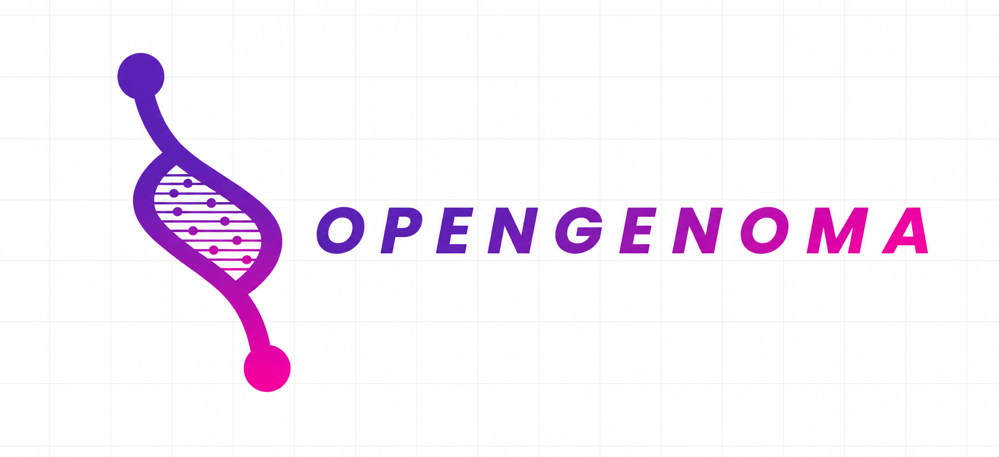

# 🧬 Genoma — Agent-Agnostic Evolution Dashboard

<div align="center">
  
</div>

**Autonomous Evolution Interface** — Cross-agent observability, evaluation, and evolution dashboard for any AI coding agent (Claude Code, Hermes, Codex, OpenCode, etc.).

---

## ❓ ¿Qué es?

Genoma es la interfaz web que permite **monitorear, evaluar y evolucionar** runs de cualquier agente AI en tiempo real. Agnóstico a provider: funciona con Claude Code, Hermes, Codex, o cualquier agente que genere traces. Conecta con el backend FastAPI (:8000) y expone:

- **Overview** — Métricas globales, estado del backend, últimos evolution runs
- **Skill Hub** — Catálogo multi-provider de 229+ skills, toggle enable/disable
- **Evolution** — Lanzar y monitorear evoluciones DSPy+GEPA con约束es de seguridad
- **Datasets** — Gestión de datasets de prueba y holdout para validación
- **Metrics** — Scores, tasas de éxito, tiempos, deltas before/after
- **Live Logs** — Streaming en tiempo real vía WebSocket
- **Curator** — Lifecycle management (active → stale → archive) con pin/restore
- **Settings** — Configuración del ecosistema

---

## 🎯 ¿Qué resuelve?

| Problema | Solución |
|---|---|
| Skills estancadas sin mejora medible | Evolution automatizada con DSPy — mide delta (before → after) no scores absolutos |
| Catálogo caótico (229+ skills) | Curator: clasifica active/stale/archived, detecta skills sin uso, consolida duplicados |
| Zero observabilidad de agentes | Métricas en tiempo real, WebSocket streaming, Promethean traces |
| Validación débil (sin holdout) | Datasets con splits train/test, LLM Judge para evaluar evoluciones |
| Setup frágil | Health check automático, Circuit Breaker, auto-reconnect |

---

## 🚀 Instalación & Startup

### NPM CLI (Recomendado — usuarios)

Instala Genoma globalmente desde npm registry:

```bash
npx genoma@latest serve
```

Esto:
- ✅ Instala dependencias (Node.js, Python 3.10+, pnpm)
- ✅ Inicia backend en `http://localhost:8000`
- ✅ Inicia frontend en `http://localhost:3000`
- ✅ Inicia MCP server en stdio (para agents)
- ✅ Maneja shutdown graceful en Ctrl+C

**Requisitos:**
- Node.js 18+
- Python 3.10+
- `ANTHROPIC_API_KEY` (u otras API keys para evolution)

### Local Development (./run.sh)

```bash
./run.sh
```

Inicia backend (:8000) + frontend (:3000) + MCP en paralelo. Ctrl+C kills todos.

### Manual setup

```bash
# Terminal 1: Backend
python3 -m pip install fastapi uvicorn pydantic python-dotenv --break-system-packages -q
python3 -m uvicorn backend.main:app --reload --port 8000

# Terminal 2: Frontend
pnpm install --ignore-scripts
pnpm dev          # → http://localhost:3000
```

### Build para producción

```bash
pnpm build        # TypeScript + Turbopack, 0 errores
pnpm start        # Production server
```

### Configuración requerida (para evolución de skills)

```bash
export ANTHROPIC_API_KEY="sk-ant-..."
# O OPENROUTER_API_KEY, OPENAI_API_KEY, etc.
```

---

## 🔌 MCP / Comunicación

Genoma expone 3 canales de comunicación:

### MCP Server (stdio) — Para Agents

Agents (Claude Code, Codex, etc.) se conectan via MCP protocol (stdio transport). 4 tools disponibles:

| Tool | Input | Output |
|---|---|---|
| `ingest_run` | `run_id`, `agent_name`, `started_at`, `task_name`, `outcome` + optionals | Inserted/updated run ID |
| `ingest_trace` | `agent`, `agent_version`, `timestamp`, `task`, `outcome` + optionals | Trace ID + canonical run ID |
| `query_runs` | `agent_name`, `outcome`, `repo`, `since`, `until`, `limit` (optional) | Array of past runs |
| `get_agent_stats` | `agent_name` (optional) | Per-agent performance summary |

Ejemplo (Claude Code):
```bash
# Genoma MCP server runs automatically when you do: npx genoma serve
# Claude Code agent can then invoke tools via stdio
```

El dashboard se comunica con el backend por 2 canales adicionales:

### REST API (`http://localhost:8000`)

| Endpoint | Verbo | Descripción |
|---|---|---|
| `/api/health` | `GET` | Health check (skills count, categorías) |
| `/api/metrics` | `GET` | Métricas agregadas (runs, tasa éxito, avg improvement) |
| `/api/skills` | `GET` | Lista plana de skills |
| `/api/skills/providers` | `GET` | Skills agrupadas por provider |
| `/api/skills/{name}` | `GET` | Detalle completo (frontmatter + body) |
| `/api/skills/toggle` | `POST` | Enable/disable skill por provider |
| `/api/skills/refresh` | `GET` | Re-scan del filesystem |
| `/api/evolution/start` | `POST` | Lanzar evolución (`skill_name`, `iterations`) |
| `/api/evolution/runs` | `GET` | Historial de runs |
| `/api/evolution/validate/{name}` | `POST` | Validar constraints pre-evolución |
| `/api/jobs` | `GET` | Jobs activos/completados |
| `/api/jobs/{id}` | `DELETE` | Cancelar job |
| `/api/jobs/{id}/logs` | `GET` | Logs live de un job |
| `/api/datasets` | `GET` | Datasets disponibles |
| `/api/datasets/{skill}` | `GET` | Splits (train/holdout) de un dataset |
| `/api/curator/status` | `GET` | Estado del curator (active/stale/archived counts) |
| `/api/curator/skills` | `GET` | Skills con metadata de uso |
| `/api/curator/run` | `POST` | Ejecutar curator (clasifica + archiva) |
| `/api/curator/pin/{skill}` | `POST` | Pinear skill (inmune a archive) |
| `/api/curator/restore/{skill}` | `POST` | Restaurar skill archivada |
| `/api/memory` | `GET` | Memoria persistente del agente |
| `/api/graph` | `GET` | Knowledge graph |
| `/api/promethean/traces` | `POST` | Enviar trace de ejecución |
| `/api/promethean/status` | `GET` | Estado del ciclo Promethean |
| `/api/runs` | `GET` | Lista canonical runs (agent, outcome, repo, limit) |
| `/api/runs/{id}` | `GET` | Run detallado con métricas + errors |
| `/api/agents` | `GET` | Resumen por agente (count, success_rate, tokens) |
| `/api/runs/migrate` | `POST` | Migrar runs Hermes + Claude Code a SQLite |
| `/api/runs/{id}/evaluate` | `POST` | Evaluar run con scorers composables |
| `/api/runs/{id}/scores` | `GET` | Scores de evaluación guardados |
| `/api/runs/compare` | `POST` | Regression detection (baseline vs evolved) |
| `/api/skills/{name}/evolve` | `POST` | Evolucionar skill con SDD optimizer |

### WebSocket (`ws://localhost:8000/ws/stream`)

Streaming en tiempo real de eventos del backend. El dashboard se auto-reconecta cada 3s si se cae.

### Next.js Proxy (`/api/*`)

El `app/api/[...path]/route.ts` actúa como catch-all proxy hacia `http://localhost:8000/api/*`, permitiendo llamadas relativas desde el frontend sin CORS.

---

## ✨ Características

- 🧬 **Genoma Design System** — `#002444` (Navy), `#a93800` (Orange), `#fcf9f8` (Warm White)
- 🔤 **Inter** (rsms/inter, variable font) + Geist Mono
- 🧩 **shadcn/ui v4** — Sidebar colapsable a iconos, tooltips, sheets, cards
- 🌓 **Dark mode** — Script inline anti-FOUC + animated toggler
- 📐 **Pretext.js** — Text layout measurement sin DOM
- ⚡ **CountUp** — Animaciones de números con `useState`
- 🎯 **SpotlightCard** — Efecto hover con gradiente radial
- 📡 **WebSocket** — Auto-reconnect con token de sesión
- 🛡️ **Circuit Breaker** — Health check + banner "Backend Unavailable" + retry
- 📱 **Responsive** — Sidebar drawer en mobile (vía shadcn Sheet)

---

## 📦 Stack

| Capa | Tecnología |
|---|---|
| Framework | Next.js 16.2.4 (Turbopack) |
| Estilos | Tailwind CSS v4 + `tw-animate-css` |
| Componentes | shadcn/ui v4 (`radix-nova`) |
| Fuente | Inter variable (`next/font/google`) |
| Animaciones | Framer Motion 12.x |
| Datos | TanStack React Query 5 |
| Iconos | Lucide React |
| Medición texto | Pretext.js 0.0.6 |
| Tema | next-themes (`genoma-theme`) |

---

## 🎨 Design Rules (GENOMA.md)

1. **No-Line Rule** — Sin bordes `1px`. Separación por shifts de background + espaciado
2. **Glass & Gradient** — Headers `backdrop-blur-xl`, CTAs gradiente `135deg`
3. **Shadow Rule** — `editorial-shadow`: `0px 20px 40px rgba(28,27,27,0.06)`
4. **No-Divider Rule** — Ítems separados solo por espaciado vertical

---

## Agent-Agnostic Evolution Layer

Extensión del sistema original para soportar cualquier agente (Claude Code, Codex, OpenCode) usando el mismo motor de evaluación que Hermes. Los datos de cualquier agente se normalizan a `CanonicalRun` y se evalúan con los mismos scorers.

### Cómo genera las evaluaciones: Promethean + GEPA + DSPy

#### 1. Promethean (Sistema base)

Promethean es la capa de evaluación de Hermes. Define el contrato entre ejecución y validación:

- `TraceRecord`: Modelo canónico de una traza de ejecución
- `TraceIngestor`: Recolecta trazas desde `~/.hermes/traces/ingested/`
- `DeltaValidator`: Valida skills usando un dataset con split holdout

#### 2. GEPA (Modelo matemático de evaluación)

GEPA (Generic Evolutionary Pattern Analyzer) implementa un ciclo de mejora iterativa basado en **holdout validation con comparación delta**:

```
Dataset = train_set + holdout_set  (holdout ≈ 30% por defecto)

Baseline:
  success_rate_baseline = count(resolved) / count(holdout)

Evolved (post-compilación DSPy):
  success_rate_evolved = baseline + compilation.delta

Delta:
  Δ[metric] = evolved[metric] - baseline[metric]

Gate de aceptación:
  passed = |Δ[primary_metric]| ≥ threshold
```

**Nota importante:** La simulación actual es aritmética — usa el `compilation.delta` que reporta DSPy sobre el baseline. No ejecuta el skill real contra el holdout. En producción esto debería ejecutar el skill compilado directamente.

#### 3. DSPy (Optimizer de prompts)

DSPy optimiza las instrucciones del skill usando métodos que no requieren gradientes (LLMs son non-differentiable):

- **Bootstrap Few-Shot**: Muestrea ejemplos del dataset, los ejecuta, filtra por métrica, usa top-k como demonstrations
- **MIPRO**: Bayesian optimization sobre el espacio de instrucciones del prompt
- `compilation.delta` = mejora de métrica que el optimizer reportó

DSPy no ejecuta el modelo directamente — compila el programa de prompts para maximizar una función de métrica M(ejemplo, predicción) ∈ [0, 1].

#### 4. DeltaScorer (Integración en evaluation engine)

El `DeltaScorer` del evaluation engine es el puente entre DSPy/GEPA y el sistema de scoring agnóstico:

```python
# Solo aplica a Hermes runs con context.skill_name
def applies_to(run: CanonicalRun) -> bool:
    return run.agent_name == "hermes" and "skill_name" in run.context

# Wraps DeltaValidator.validate()
def score(run: CanonicalRun) -> EvalScore:
    result = validator.validate(skill_name, baseline)
    score = 1.0 if result["passed"] else 0.0
    return EvalScore(scorer="delta", score=score, passed=result["passed"])
```

---

### Agent-Agnostic Architecture

```
COLLECTORS (normalizan trazas propias de cada agente)
  HermesCollector     ── TraceRecord → CanonicalRun
  ClaudeCodeCollector ── JSONL session events → CanonicalRun
  (extensible)

          │
          ▼ CanonicalRun (schema canónico)
          │  run_id, agent_name, collector, outcome,
          │  tool_calls[], metrics{}, errors[], context{}
          │
          ▼

STORAGE (SQLite, WAL mode)
  runs / tool_calls / run_metrics / run_errors / eval_scores

          │
          ▼

EVALUATION ENGINE (scorers composables)
  OutcomeScorer        success=1.0, partial=0.5, failure=0.0
  ToolEfficiencyScorer unique_tools / total_calls (threshold > 0.3)
  TokenCostScorer      max(0, 1 - tokens/50000)
  ErrorRecoveryScorer  success_no_errors=1.0, success_with_errors=0.8
  DeltaScorer          wraps DeltaValidator (solo Hermes)

  aggregate_score = mean(scores aplicables)

  detect_regression:
    delta = evolved_aggregate - baseline_aggregate
    regression  = delta < -threshold
    improvement = delta > threshold
    neutral     = |delta| ≤ threshold
```

### Nuevos API Endpoints

| Endpoint | Verbo | Descripción |
|---|---|---|
| `/api/runs` | `GET` | Lista runs con filtros: agent, outcome, repo, since, until, limit |
| `/api/runs/{id}` | `GET` | Run detallado con metrics, tool_calls, errors |
| `/api/runs/{id}/evaluate` | `POST` | Corre scorers sobre el run, devuelve scores + aggregate |
| `/api/runs/{id}/scores` | `GET` | Scores de evaluación guardados en DB |
| `/api/runs/compare` | `POST` | Regression detection: baseline vs evolved (threshold configurable) |
| `/api/agents` | `GET` | Stats por agente: count, success_rate, avg_tokens |
| `/api/runs/migrate` | `POST` | Migra traces existentes (Hermes + Claude Code) a SQLite |

### Adding a New Collector

```python
# 1. Crear backend/collectors/my_collector.py
class MyCollector:
    AGENT_NAME = "my-agent"
    VERSION = "0.1.0"

    def collect_session(self, source: Path) -> Optional[CanonicalRun]:
        # Parsear source, extraer campos requeridos
        return CanonicalRun(
            run_id=...,
            agent_name=self.AGENT_NAME,
            collector=f"{self.AGENT_NAME}-collector",
            started_at=...,
            task_name=...,
            outcome=...,
            # campos opcionales: tool_calls, metrics, errors, etc.
        )

# 2. Agregar tests en tests/collectors/test_my_collector.py
# 3. Agregar endpoint en backend/main.py
```

### Adding a New Scorer

```python
# Agregar en backend/eval/scorers.py
class MyScorer:
    name = "my_scorer"

    def score(self, run: CanonicalRun) -> EvalScore:
        score = ...  # 0.0 a 1.0
        return EvalScore(scorer=self.name, score=score, passed=score > 0.5)

    def applies_to(self, run: CanonicalRun) -> bool:
        return True  # o condición específica

# Pasar custom scorers al engine:
engine = EvaluationEngine(store=store, scorers=[MyScorer(), OutcomeScorer()])
```
