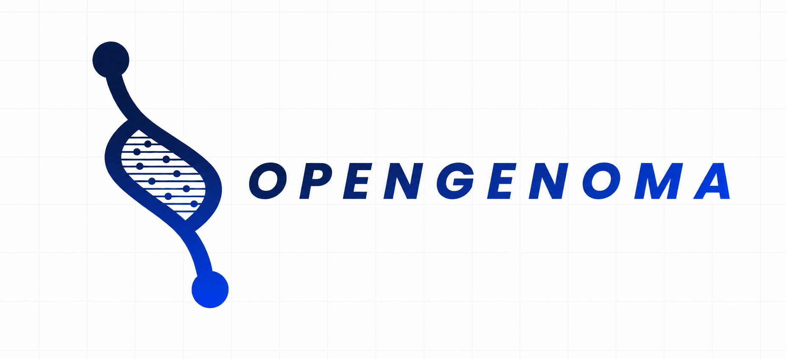
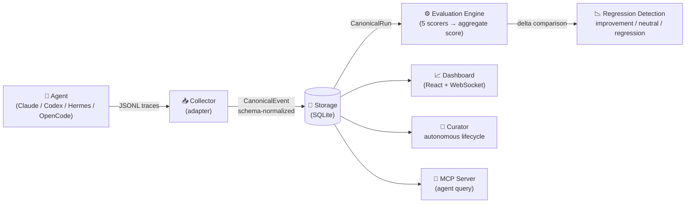
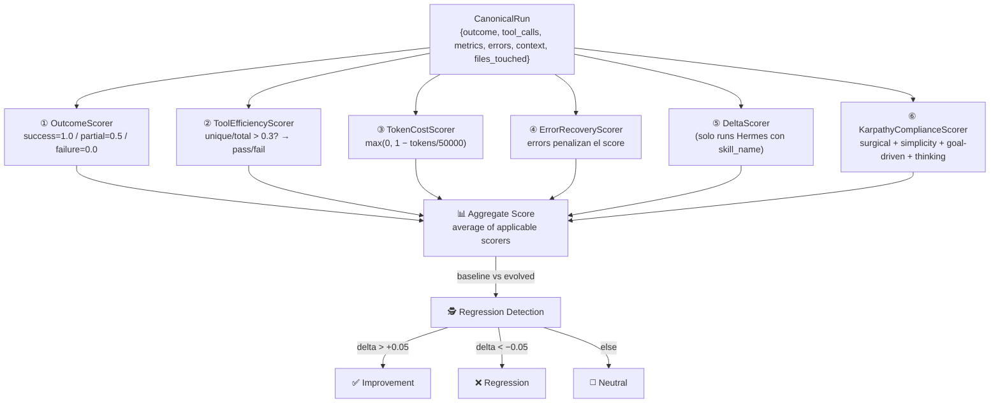
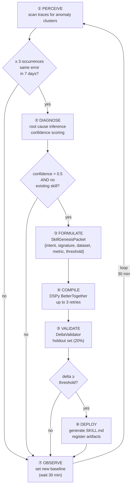

# 🧬 Genoma

<div align="center">
  
  <p><em>Agent-agnostic evolution platform for AI coding agents.</em></p>
</div>

> **La posta:** Genoma es un laboratorio de mejora continua para agents. Funciona, te da data concreta, y si le metés modelos grosos
 las evoluciones son genuinamente útiles. Pero está en esa etapa incómoda donde ya hace cosas copadas pero todavía no es "instalá y olvidate".

---

## What Is Genoma?

Genoma is a dashboard and evaluation engine for AI coding agents. It answers one question that no single-agent tool can:

> *"Is my agent actually getting better?"*

Not anecdotally. Not by vibes. By comparing runs across models, agents, prompts, and skills — on the same tasks, with the same evaluation criteria, over time.

It works with **any agent** that can emit JSONL traces: Claude Code, OpenCode, Codex CLI, Hermes, Gemini CLI, Cursor, or your own custom harness. Genoma normalizes them into a common schema, scores them deterministically, and shows you what's working and what isn't.

It also runs an **autonomous improvement cycle** every 30 minutes that looks for recurring errors, diagnoses root causes, and if it finds a pattern with no existing solution, compiles a new skill to fix it. Sometimes that works great. Sometimes the model isn't good enough and it skips the cycle. No harm done.

### What it's NOT

- Not a product you install for your team and walk away. You need Python, Node.js, env vars, and tolerance for rough edges.
- Not a replacement for your agent's native tools. Genoma observes, evaluates, and suggests — it doesn't run your agent.
- Not cloud-native by default. Your data lives in `~/.genoma/` on your machine. Cloud is optional.
- Not production-ready security. Auth checks for header *presence*, not header *validity* (any non-empty token passes).

---

## The Problem

If you run more than one coding agent, you have a data problem:

| Problem | Consequence |
|---------|-------------|
| **Proprietary data models** | Each agent stores runs in its own format. No cross-agent comparison. |
| **No shared evaluation** | "Claude was better at this task" is anecdote, not data. |
| **Improvement loops are agent-locked** | A prompt optimization found with one agent can't be reused by another. |
| **No regression tracking** | You don't know if a new skill *actually* improved things or made them worse. |

Genoma solves this with a **canonical event schema** — one data format that every agent emits into, one evaluation engine that scores them all, and one dashboard that shows you what's working.

---

## How It Works


```mermaid
flowchart LR
    Agent["🧠 Agent<br/>(Claude / Codex / Hermes / OpenCode)"] -->|JSONL traces| Collector["📥 Collector<br/>(adapter)"]
    Collector -->|CanonicalEvent<br/>schema-normalized| Store[("💾 Storage<br/>(SQLite)")]
    Store -->|CanonicalRun| Engine["⚙️ Evaluation Engine<br/>(5 scorers → aggregate score)"]
    Engine -->|delta comparison| Regression["📉 Regression Detection<br/>improvement / neutral / regression"]
    Store --> Dashboard["📈 Dashboard<br/>(React + WebSocket)"]
    Store --> Curator["🔄 Curator<br/>autonomous lifecycle"]
    Store --> MCP["🔌 MCP Server<br/>(agent query)"]
```

### Core Layers

1. **Collectors / Adapters** — Small modules that ingest an agent's native output (CLI logs, JSON sessions, API traces) and convert them into the canonical event schema. This is the only layer that knows how a specific agent speaks.

2. **Canonical Event Schema** — A shared data model for runs, tool calls, file changes, errors, metrics, and evaluation scores. Every agent produces the same shape. Every tool consumes the same shape.

3. **Normalization & Storage** — Deduplicates, validates, persists, and indexes events. SQLite for local-first, Postgres-ready for team deployments.

4. **Evaluation Engine** — Runs deterministic checks over any run: outcome scoring, tool efficiency, token cost, error recovery, and delta validation.

5. **Dashboard** — Real-time WebSocket-driven UI showing per-run timelines, agent comparisons, regression detection, and improvement tracking.

6. **Curator** — Tracks skill usage, auto-archives stale skills, runs quality audits, and generates improvement proposals via AI review.

7. **MCP Server** — Lets agents query the platform programmatically: "What was my last run?", "Show regressions", "Compare these two runs".

### Computation Engine

Every runtime event eventually becomes a `CanonicalRun` that the evaluation engine scores in 6 dimensions:


```mermaid
flowchart TD
    Run["CanonicalRun<br/>{outcome, tool_calls, metrics, errors, context, files_touched}"] --> S1["① OutcomeScorer<br/>success=1.0 / partial=0.5 / failure=0.0"]
    Run --> S2["② ToolEfficiencyScorer<br/>unique/total > 0.3? → pass/fail"]
    Run --> S3["③ TokenCostScorer<br/>max(0, 1 − tokens/50000)"]
    Run --> S4["④ ErrorRecoveryScorer<br/>errors penalizan el score"]
    Run --> S5["⑤ DeltaScorer<br/>(solo runs Hermes con skill_name)"]
    Run --> S6["⑥ KarpathyComplianceScorer<br/>surgical + simplicity + goal-driven + thinking"]
    S1 & S2 & S3 & S4 & S5 & S6 --> Aggregate["📊 Aggregate Score<br/>average of applicable scorers"]
    Aggregate -->|baseline vs evolved| Detect["🕵️ Regression Detection"]
    Detect -->|delta > +0.05| Imp["✅ Improvement"]
    Detect -->|delta < −0.05| Reg["❌ Regression"]
    Detect -->|else| Neut["◻️ Neutral"]
```

The aggregate score feeds the dashboard, the regression detector, and the curator's prioritization queue. All scores are persisted alongside the run in SQLite. The `KarpathyComplianceScorer` evaluates **process quality** — surgical changes (few files touched), simplicity (efficient tool calls), goal-driven execution (outcome matches errors), and thinking before coding (exploration before execution).

---

## Evolution Cycle

Genoma's autonomous improvement engine runs a **7-phase Promethean cycle** every 30 minutes: it scans failure traces from all connected agents, and if it finds a recurring pattern that no existing skill covers, it tries to compile a new one.


```mermaid
flowchart TD
    P["① PERCEIVE<br/>scan traces for anomaly clusters"] --> D{"≥ 3 occurrences<br/>same error<br/>in 7 days?"}
    D -->|no| O["⑦ OBSERVE<br/>set new baseline<br/>(wait 30 min)"]
    D -->|yes| D2["② DIAGNOSE<br/>root cause inference<br/>confidence scoring"]
    D2 --> A{"confidence > 0.5<br/>AND no<br/>existing skill?"}
    A -->|no| O
    A -->|yes| F["③ FORMULATE<br/>SkillGenesisPacket<br/>{intent, signature, dataset, metric, threshold}"]
    F --> C["④ COMPILE<br/>DSPy BetterTogether<br/>up to 3 retries"]
    C --> V["⑤ VALIDATE<br/>DeltaValidator<br/>holdout set (20%)"]
    V --> PASS{"delta ≥<br/>threshold?"}
    PASS -->|no| O
    PASS -->|yes| DEP["⑥ DEPLOY<br/>generate SKILL.md<br/>register artifacts"]
    DEP --> O
    O -->|loop<br/>30 min| P
```

**Phase details:**

| # | Phase | What happens | Gate |
|---|-------|-------------|------|
| ① | **Perceive** | Scans `~/.genoma/traces/ingested/` for failures, groups by `error_signature`, counts occurrences across agents | ≥ 3 occurrences in 7 days |
| ② | **Diagnose** | Infers root cause category (timeout, auth, build, network..., plus [Karpathy behavioral patterns](https://x.com/karpathy/status/2015883857489522876): non-surgical changes, over-engineering, no success criteria) and assigns confidence | confidence > 0.5 AND no covering skill |
| ③ | **Formulate** | Extracts trace dataset, infers DSPy signature (input → output schema), builds `SkillGenesisPacket` with intent, dataset path, metric, and acceptance threshold | Always if actionable |
| ④ | **Compile** | Runs DSPy `BetterTogether` optimizer (BootstrapFewShot + ChainOfThought) in a subprocess with up to 3 retries and 5-minute timeout. Falls back to `evolve_now.py` if DSPy unavailable | max 3 attempts |
| ⑤ | **Validate** | Loads holdout set (20%), simulates baseline vs evolved performance, computes delta, and assesses [Karpathy compliance](https://github.com/leandro-thomas/hermes-agent/blob/main/skills/karpathy-guidelines/SKILL.md) of the generated skill (focused intent, clear metric). Passes if `delta ≥ dynamic_threshold` | threshold depends on confidence |
| ⑥ | **Deploy** | Categorizes the skill, generates `SKILL.md` with frontmatter + metadata, copies compiled artifacts, logs deployment | only if validation passed |
| ⑦ | **Observe** | Closes the cycle: sets new baseline, saves cycle state. Waits 30 minutes before the next Perceive scan | always |

When compilation or validation fails, the cycle skips deployment and observes — the trace data remains available for the next cycle. No bad skills are ever deployed.

**Caveat:** This cycle is ambitious and its effectiveness depends heavily on the model you're running. With DSPy installed and a capable model it genuinely produces useful skills. Without them, it'll skip most cycles quietly.

---

## Technical Architecture

### Frontend (`src/`)

| Stack | Detail |
|-------|--------|
| **Framework** | React 19 + vinext (Vite-based Next.js API surface) |
| **State / Data** | TanStack React Query v5 for all server state |
| **UI** | shadcn/ui + Tailwind CSS v4 + framer-motion |
| **Real-time** | WebSocket with exponential backoff reconnection |
| **Auth** | Session token (`X-Hermes-Session-Token` header) |
| **Client API** | Typed `ApiError` classes, AbortController timeouts, auto-retry |
| **Routing** | File-based via vinext |

### Backend (`backend/`)

| Stack | Detail |
|-------|--------|
| **Framework** | FastAPI (Python 3.10+) |
| **Auth** | Env-based token (`GENOMA_SESSION_TOKEN`) — **note: checks header presence, not validity** |
| **Security** | Path traversal prevention, URL-encoded separator detection |
| **Real-time** | WebSocket connection manager with broadcast |
| **Storage** | JSON-based skill registry + SQLite |
| **CLI** | Single `npx genoma` binary with subcommands (`serve`, `dev`, `doctor`, `mcp`) |

### Key Endpoints

| Method | Path | Description |
|--------|------|-------------|
| `GET` | `/api/health` | Health check |
| `GET` | `/api/skills` | List all detected skills |
| `GET` | `/api/skills/:name` | Skill detail + description |
| `GET` | `/api/skills/:name/history` | Evolution history for a skill |
| `GET` | `/api/jobs` | Evolution job list |
| `POST` | `/api/evolve` | Start a new evolution run |
| `GET` | `/api/metrics` | Aggregate dashboard metrics |
| `WS` | `/api/ws` | Real-time evolution log stream |
| `GET` | `/api/curator/status` | Curator health & last run info |
| `POST` | `/api/curator/run` | Trigger curator review pass |

### Where Data Lives

```
~/.genoma/
├── skills/                 # AI agent skill files (SKILL.md + code)
│   ├── .usage.json         # Usage telemetry
│   └── .archive/           # Archived/inactive skills
├── logs/
│   └── curator/            # Curator run reports
├── memory/                 # Agent memory store
├── datasets/               # Training/eval datasets
├── sessions/               # Agent session logs
└── hermes-agent/           # Agent repository (default, Hermes legacy)
```

---

## Quick Start

```bash
# One command — starts backend (:8000) + frontend (:3000) + MCP
npx genoma@latest serve

# Or for development:
./run.sh
```

Requires **Node.js 18+**, **Python 3.10+**, and an LLM provider key.

### Environment

Copy `.env.example` to `.env.local` and configure at least one provider:

```bash
cp .env.example .env.local
# Edit .env.local with your API keys
```

### Manual Setup

```bash
# Terminal 1: Backend
python3 -m pip install -r backend/requirements.txt
python3 -m uvicorn backend.main:app --reload --port 8000

# Terminal 2: Frontend
pnpm install
pnpm dev
```

---

## The Curator

The Curator is Genoma's skill lifecycle manager. It:

- **Tracks usage** — which skills are used, how often, and their success rates
- **Archives stale skills** — skills untouched for 90+ days move to `.archive/`
- **Pins active skills** — critical skills are protected from auto-archival
- **Audits skill quality** — evaluates each skill against a "perfect skill" model (completeness, documentation, instruction quality, example realism, resource coverage)
- **Generates improvement proposals** — uses AI review to recommend specific improvements to prompts, tool descriptions, and code paths

All curator actions are **review-gated** — no automatic changes without human approval.

---

## Model Recommendations

Genoma's evolution and curation pipelines use LLMs for evaluation, improvement proposals, and auto-audit. The quality of these outputs is **directly proportional to the model's reasoning capability**.

**For the best results, use high-end reasoning models:**

| Use Case | Recommended Model | Why |
|----------|------------------|-----|
| **Skill evolution** | Claude Opus 4.8 / GPT-5.5 | #1 razonamiento, 88.6% SWE-Bench Verified, código quirúrgico |
| **Curator audit** | Gemini 3.1 Pro / Claude Opus 4.8 | 2M tokens de contexto, juicio de calidad matizado para skills grandes |
| **Improvement proposals** | Claude Sonnet 4.6 / GPT-5.5 | Instrucciones detalladas, diffs específicos, mejor fine-tuning |
| **Benchmark evaluation** | DeepSeek V4-Pro / Claude Haiku 4 | Rápido y costo-efectivo ($1.10/M tokens), 80.4% SWE-Bench |
| **Rapid iteration** | Gemini 3.5 Flash / DeepSeek V4-Pro | Baja latencia, Terminal-Bench 76.2%, $1.50/$9 por 1M tokens |

| **Best value (open-weight)** | DeepSeek V4-Pro | Código de alta calidad, costo 10× menor que claude, self-hosteable |
| **Specialized: writing** | Claude Sonnet 4.6 | Mejor calidad de escritura, instrucciones creativas, tono consistente |

Genoma respeta una **cadena de prioridad de providers**: Ollama (local) > OpenCode > OpenRouter > Anthropic > Google. Seteá tu modelo preferido via env vars:

```env
# Evolución con el mejor modelo disponible
OPENAI_API_KEY=sk-...
# O para Anthropic
ANTHROPIC_API_KEY=sk-ant-...
# Model override para el pipeline de evolución
SDD_EVOLVE_MODEL=openai/gpt-5.5
# Alternativa costo-efectiva para benchmarks
BENCHMARK_MODEL=anthropic/claude-haiku-4-20260515
```

> **Rule of thumb:** If you use a frontier model for evolution and curation, the improvements are more specific, more correct, and require less human rework. Cutting corners on model quality costs more time in review than it saves in tokens.

---

## Philosophy

1. **Agent-agnostic first.** If it only works with one agent, the design is wrong.
2. **Schema before UI.** If the data model is wrong, the dashboard is a lie.
3. **Evaluation before improvement.** You cannot optimize what you cannot measure.
4. **Human in the loop.** Auto-generated changes require review, tests, and approval.
5. **Local-first.** Your agent data belongs to you. Cloud is optional, not mandatory.

---

## License

MIT

---

## Related

- [Hermes Agent](https://github.com/leandro-thomas/hermes-agent) — The original agent Genoma evolved from
- [SDD](https://github.com/leandro-thomas/sdd) — Spec-Driven Development methodology
